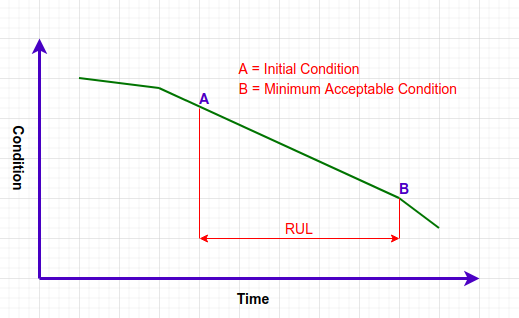

# The Machine Learning (ML) Project 

Considering a fictitious business case where predictive analytics can be applied to a real life project. The scenario occurs in an industrial workplace looking to employ a **predictive maintenance model** in place of a **preventative** one as the primary strategy to maintain heavy equipment. 

This dataset has been selected as an example of training a Machine Learning model to predict the degradation process (gradual clogging) of a replaceable part, in this case a dust filter.

The project is aimed to provide an example of added value to a variety of industrial users looking to optimize maintenance programs and or industrial processes that require some sort of filtering, like the screening for ore concentrate, gas particles, materials in water or other slurries.

The added value of a predictive model includes:
* Identify patterns that lead to potential problems or failures
* Identifying trends to aid future business decisions and/or investments
* Confidently predict the frequency of required maintenance
* Shorter equipment downtimes
* Actively preventing failures whilst optimizing the value of replacement parts
* Lowering the cost of preventive maintenance
* Avoiding the cost of repair/corrective maintenance
* Avoiding cost of replacing equipment
* Increasing the expected useful life of equipment
* Minimizing energy consumption

---

<details>
<summary style="font-size: 1.2rem;"><strong>Table of Contents:</strong> (Dropdown List)</summary>
<!-- ## Table of Contents: -->

### 1. [Business Case(s) Understanding](#1-business-case-understanding)
* [Business Case Surveys](#business-case-surveys)
* [Business Requirements](#business-requirements)

### 2. [Data Understanding]()
* [The Dataset](#the-dataset)
* [Dataset Content](#dataset-content)
* [Further Considerations](#further-data-considerations)

### 3. [Initial Data Cleaning](#3-initial-data-cleaning-1)

### 4. [Initial Data Engineering](#4-initial-data-engineering)
* [Calculated Variables](#calculated-variables)
* [Reordering Data Set References](#alteration-of-data_no-references)
* [Splitting Datasets](#splitting-datasets)

### 5. [Validating Hypothesis](#5-validating-hypothesis-1)

### 6. [Mapping Business Requirements](#6-mapping-business-requirements-to-visualizations-and-ml-tasks-1) to Visualizations and ML tasks
* Requirement 1 : [Predict Current RUL]()
* Requirement 2 : [Optimal time to Change Filter]()
* Requirement 3 : [Dust Cluster Grouping]()
* Requirement 4 : [Correlations for Maximizing RUL]()

### 7. ML Business Cases
* Business Case 1 : [Predict Current RUL]()
    * Model 1 - Regression Model
       * Section for discussion of each Notebook on:
            * Data Exploration NB
            * [Correlation Study]() NB
            * EDA on selected variables NB
            * Conclusions and Next Steps NB
    * Model 2 - Classification Model
        * ...

* Business Case 2 : [Predict Optimal Part Change]()
    * Model 1 - Regression Model
        * ...

    * Model 2 - Classification Model
        * ...

* Business Case 3 : [Observe Dust Cluster Group]()
    * Model 1 - Clustering Model
        * ...
    
### 8. Data Visualization and Correlation Study
* Business Case 4 : [RUL Correlations]()
    * We will inspect the data related to the RUL.
    * We will conduct a correlation study (Pearson and Spearman) to understand better how the variables are correlated to RUL.
    * We will plot the main variables against RUL to visualize insights.

### 9. [Display, Deliver, Communicate]()
* [API]()
* [Dashboard Delivery (Streamlit)]()
    * Page 1: [Quick project summary]()
    * Page 2: [Replacement Part Predictor]()
    * Page 3: [Project Hypothesis and Validation]()
    * Page 4: [Predict Differential Pressure Model]()
    * Page 5: [Predict Replacement Timing Model]()
    * Page 6: [Cluster Analysis Model]() (what groups this occurs in)
    * Page 7: [Maximizing Useful Life Study]()

</details>

---

### Summary of Terms & Jargon

* **The client** is the business we are providing a Machine Learning (ML) solution for.
* **The stakeholder** is a team, business or entity involved with the development of the machine learning model.
* **A user** is a person or business looking to use the model to inform business decisions.
* **A prospect** is a potential new customer
* **The project** is the plan and delivery of a ML solution to meet a variety of requirements to Predict Maintenance of a replaceable part.
* The **replaceable part** for this project, is considered a filter mat made out of randomly oriented, non-woven fibre material.
* **Differential Pressure** is a measure of the change in air pressures before and after the filtering process.
* **RUL** is Remaining Useful Life; the amount of time an asset (machine, replaceable part, filter, etc.) is likely to operate before it requires repair or replacement.
* The **filter degradation process** is the gradual performance decline over time, which can be quantified and used by statistical models.
* **The threshold** is the actual time when the experiment exceeded the threshold, used to define when the observations pass into the zone of failure.
* A **life test** is the entire test cycle from the first instance of a Data_No to the last.
* **Filter failure** is signified when the **differential pressure** across the filter **exceeds 600 Pa**.
* **Right censored data** is where “failure” has/will occur after the recorded time.
* **Zone of Failure** is the last 10% of RUL for that replacement part.


## 1. Business Case Understanding

As a Data Analyst, we have been requested by the Power Technique division (the client) to provide actionable insights and data-driven recommendations to a corporation that manufactures industrial tools and equipment. 

This client has a substantial customer base in oil and gas and offshore industries, as well as power plants and surface and underground mining. They are interested in promoting the management of preventative maintenance and understanding how the industrial sales team could better interact with prospects to the benefits of transitioning toward predictive maintenance. The client has shared the data in two files:  

* **Train_Data.csv** - 50% of the data without RUL to fit or train the model.
* **Test_Data.csv** - 50% of the data with RUL with the actual recorded values of time when the experiment exceeded the threshold.

The data is segmented into 50 life tests (data bins). The amount of observations in each bin varies depending on the input variables and a random time when the tail of the data was removed to produce a [right censored](#right-censored-data) dataset.

### Business Case Surveys 
To determine the number and depth of ML Models required to meet the stakeholders requirements, an understanding of the business needs and wants needs to be obtained. This needs to contain a clear expression of the requirements that stakeholders need to be solved. 

This process is developed in a **business case** that can be applied to each ML model. These consider:
* The Model objective
* The Outcome 
* The Metrics 
* The Output
* The Heuristic Information (ie calculated guesses, trial and error or rules of thumb)
* The Training data 
* Dashboard Design

The information for this process has been collected from the stakeholders as a Survey - [Business Case Questionnaire](https://docs.google.com/forms/d/e/1FAIpQLSfIjxD0Ki9793LTQ2szr3-qWKXUsMbQS1AhM80BCAvltxmu4A/viewform) and individually summarized in the attached [Business Case Understanding](https://docs.google.com/document/d/1PnWhRg7F-0idx_qIOnzNXumI0he5jXNLqjbDqvul9kY/edit?usp=sharing) document.

### Business Requirements
From the above process, we confirm that stakeholders are interested in: 
1. Using a predictive model to **determine the current Reaming Useful Life (RUL)** of any given filter (replaceable part) and indicate if a filter is currently **useable** or **not-useable**.

2. The solution should indicate **the optimal time to change an air filter**, in RUL units. 
    * i.e. Confirm the industry rule of thumb to replace at a 10% RUL zone is correct or does the data indicate something else?
    * Optimal time is considered the cost benefit trade off between maximizing useful life and minimizing the risk of failure.

3. If a filter fails, or fails prematurely, **which dust type cluster** does it belong to?

4. **Understanding the patterns** from the filter degradation process to reveal the most relevant factors that influence the time that a replacement part will fail and **which factors could extend its lifespan**?

#### As a Data Practitioner, we are additionally interested in:
5. Making the most of the not-to-failure (right-censored) test data.

These requirements can now be evaluated against the dataset provided to devise the type of ML models to be delivered by this project.

## 2. Data Understanding
### The Dataset
* The dataset is sourced from [Kaggle](https://www.kaggle.com/datasets/prognosticshse/preventive-to-predicitve-maintenance) performed by Hagmeyer et al. (2021) at the Hochschule Esslingen University of Applied Sciences.
### Dataset Content
#### Summarized in the table below, the raw data set includes information about:
<details>
<summary style="font-size: 1rem;"><strong>Test Classification measures</strong></summary>

* Which one of 50 ‘lifetime test’ sequences that the observations relate to?
* Which type of three ISO_12130 standardised dust samples were used?
</details>

<details>
<summary style="font-size: 1rem;"><strong>Numerical Air Pressure observations</strong></summary>

* Indicates a change in air pressures before and after the filtering process.
</details>

<details>
<summary style="font-size: 1rem;"><strong>Numerical Air Flow observations</strong></summary>

* Indicates the air flows following the filtering process.
</details>

<details>
<summary style="font-size: 1rem;"><strong>Categorical Observations of Dust Feed</strong></summary>

* Indicates dust density fed into the system per unit of time. 
* Correlates to a numerical floating point number, which is a constant for each class
		* A2_Fine - 0.900 g/m<sup>3</sup>
		* A3_Fine - 1.025 g/m<sup>3</sup>
		* A4_Fine- 1.200 g/m<sup>3</sup>
</details>

<details>
<summary style="font-size: 1rem;"><strong>Time</strong></summary>

* Indicates the discrete intervals between live test observations. 
* Time is a direct input to the RUL calculation and indicates the total number of live tests observed in the data set. i.e. 
    * Data_no 1 takes 36.6s to the end of that tests observations
        * this indicates that there has been 366 live tests in this sample set
    * Data_no 2 take 28.2s to the end of that tests observations
        * this indicates that there has been 282 live tests in this sample set
* This was confirmed by the .count() of the .unique() variables in each Data_no variable
</details>


| Variable | Meaning | Units | Data Format | Data Type |
|---|---|---|---|---|
| **Data_no** | Test Number | Categorical Number 1 to 50 | Independent | Integer / Discrete Categorical |
 **Differential_pressure** | Pressure difference between upstream and downstream containment areas | Pascals (Pa = kg/m.s²) | Dependant | Floating point / Continuous |
| **Flow_rate** | quantity of air being moved | m<sup>3</sup>/sec | Independent | Floating point / Continuous |
| **Time** | Intervals between observations within a test as determined by sampling rate | 1/10th of a second | Independent | Floating point / Discrete (in this case) |
| **Dust_Feed** | velocity of the particle speed | mm<sup>3</sup>/s | Independent | Floating point / Continuous |
| **Dust** | 3 x types of ISO_12130 standardized dust ( A2 Fine, A3 Medium, A4 Coarse) | g/cm<sup>3</sup> | Independent | String / Discrete Number |
| **RUL** | Remaining Useful Life | Relative Units (ie 1 unit = 1 day) | Dependent | Floating point / Continuous |

### Further Data Considerations
#### **Filter medium**
The material used to filter the dust samples has been standardised across all tests. As a constant, it was not recorded as part of the datasets. Its properties were:

| Mean Fibre Diameter | 23 μm (micrometres) |
| Filter Area | 6131mm² |
| Filter Thickness | 20mm |
| Filter Packing Density | 0.014 - 0.0165 |
| Clean Filter Pressure Drop | 25 Pa at flow of 1080 m<sup>3</sup> / (h - m²) |

#### **Sampling rate**
Also not recorded as part of the supplied dataset, sampling rate is a constant, set at 10 Hz (or 0.1s per sample) for all tests.

#### **Zone of Failure**
A trade-off has to be made between wasted remaining useful life and the increased frequency of unplanned downtimes that occur in the last 10% of RUL.
* On Average, filter failure is observed to occur at the final 10% of the filter's RUL in the training data, and planned maintenance / replacement of the part would occur in this zone.
* At what point the final 10% zone commences will be a prediction based on the predicted RUL for each filer and the currently observed RUL.

#### **Important Note: Differential Pressure**
Differential pressure, the measure of the change in air pressures before and after the filtering process, seems to be a highly important variable to failure detection process, as it: 
* Is a dependent variable as it relies on a variety of factors, including flow rate, dust size, filter type, time. 
* Filter failure is considered to occur when this measure reaches 600 Pa so is expected to be highly correlated to RUL
* Depending on the rate of degradation toward the end of filter life, It may be a direct indicator of the **zone of failure**.

As the variable that a user would want to learn patterns, uncover relationships and predict using the rest of the dataset, Differential Pressure has been chosen as the primary **Target variable** for initial investigations.

## 3. Initial Data Cleaning 
Initial observation of the data reveals it is clean. There are no repeated or missing values. The df_train data set has been supplied without RUL observations as part of the testing and validation process requested by the owner.

Outside of the following initial data engineering, **the supplied dataset is considered clean**.

## 4. Initial Data Engineering
As supplied, the dataset is made up of variables that can be used to calculate measures that are potentially useful indicators to the end user (Remaining Useful Life is one of these). To include these in the data to be analyzed, the following additional calculations have been made: 
### Additional Calculations
| Variable | Meaning | Units | Data Format | Data Type |
|---|---|---|---|---|
| **Dust Density** | Numerical equivalent of dust density | g/cm<sup>3</sup> | Independent | Floating point / Continuous |
| **Dust Mass** | Mass of the dust density fed into the filter | grams | Independent | Floating point / Continuous |
| **Cumulative Dust Mass** | Cumulating dust mass fed into the filter over each test bin | grams | Independent | Floating point / Continuous |
| **Total Time of Test** | The cumulative time for the current test bin | seconds (T) | Independent | Floating point / Discrete |
| **RUL Test** | A check calculation of Remaining Useful Life from actual and calculated values in the set | Relative Units (ie 1 unit = 1 day) | Dependent | Floating point / Continuous |

#### Details of Calculations:
<details>
<summary style="font-size: 1.1rem;"><strong>Remaining Useful Life (RUL) (dropdown list)</strong></summary>



**Remaining Useful Life** is classified as **the amount of time an asset (machine, replaceable part, filter, etc.) is likely to operate before it requires repair or replacement**. This is recorded in units relative to the test case, however units can represent Seconds, Minutes, Days, Miles, Cycles or any other quantifiable data. In practice: 
* The RUL observations provided in the data are randomly right-censored. In other words, filter failure did not occur by the end of each test cycle. 
* This can be observed by the final observation of each test set in the **Differential_pressure** column. Each set does not reach the filter failure point of 600 Pa of differential pressure across the filter. This is the essence of right-censored. The data does not cover the full timeline to filter failure, however it ends somewhere before (at the right side) of this data set.
* The original idea of the author behind the test data was, at the point in time when the data in each set ends, the remaining useful life (RUL) is to be estimated.
* i.e. we are interested in the rate of change in RUL, and the subsequent shape and direction of the line(s) of best fit. This will allow us to predict RUL with some degree of certainty, based on the variables given.

For every observation, ‘RUL’ is the difference between:
* the maximum value of the ‘**time**’ in each test cycle (in this case to failure), and 
* the current observation ‘**time**’ at each test cycle

<p style="text-align: center; font-size: 1.1rem;">Remaining Useful Life (RUL) = Total time (cycles) to failure for each life test (T) - current time (t)</p>

* the RUL at the start of each test cycle was randomised to a number between the maximum time value and 3 minutes.

The resulting numerical data can then be used to observe the change in RUL and assist in producing an accurate model.

</details>


<details>
<summary style="font-size: 1.1rem;"><strong>Calculations of Mass (g)</strong></summary>

#### Calculations of Mass (g)
The mass of the dust fed each life test is a factor of dust feed and dust density. These can be sourced from the data and has been calculated as:

We know:
<p style="text-align: center; font-size: 1.2rem;">
Mass Flow Rate = Volume per second × Density</br>
MFr = Q × ρ</p>


<p style="text-align: center; font-size: 1.2rem;">
Mass = Volume × Density</br>
m = V × ρ</p>

Where:
* Q = Volume flow rate (m<sup>3</sup>/s)
* V = Volume (m<sup>3</sup>)
* ρ = mass density of the dust (kg/m<sup>3</sup>)
* T = total number of seconds in each life test


Therefore: 
<p style="text-align: center; font-size: 1.2rem;">Mass = (((Q mm<sup>3</sup>/s) / 1000 ) × ρ g/cm<sup>3</sup> ) * T</p>

* =  (((1 mm<sup>3</sup>/s) / 1000 ) × 0.9 g/cm<sup>3</sup> ) * 1s
* =  0.001 cm<sup>3</sup>/s × 0.9 g/cm<sup>3</sup>
* = 0.0009 grams every test (in this example total test duration = 1s) 

</details>

<details>
<summary style="font-size: 1.1rem;"><strong>Right Censored Data</strong></summary>

#### Right Censored Data
By definition, right censored data is incomplete data. However, In this dataset we know that the end of life for a filter is when the differential pressure across a filter is 600 Pa. 

We can therefore predict the remaining time to that end of life point based on the trajectory of the change in differential pressure values provided.

The existence of right-censored data represents a challenge in this dataset to ensure we make the most use of the existing right-censored life data variables within the training data to predict RUL. This could be performed with conventional data analysis, however the heuristic and versatile nature of machine learning makes it ideal in predicting this measure with greater statistical confidence.

This information has then formed basis of the business requirements in this hypothetical project scenario.

#### Possible considerations to manage right censored data:
* [cross-validation : evaluating estimator performance](https://scikit-learn.org/stable/modules/cross_validation.html) (in sklearn),
* The function [cross_val_predict](https://scikit-learn.org/stable/modules/cross_validation.html#:~:text=The%20function%20cross_val_predict%20is%20appropriate%20for%3A) is appropriate for: Visualisation of predictions obtained from different models.
* Model blending: When predictions of one supervised estimator are used to train another estimator in ensemble methods.

</details>

<details>
<summary style="font-size: 1.1rem;"><strong>Use of continuous vs discrete variables</strong></summary>

#### Use of continuous vs discrete variables; 
* Models designed for continuous variables can in many cases be used with discrete variables, however
* Models designed for discrete data used with continuous variables is rather a bad idea, as discrete variable models consider fixed, whole number values, with clear spaces between them. They consider data that cannot be measured or divided into smaller values, unlike continuous variables.

</details>

<details>
<summary style="font-size: 1.1rem;"><strong>Modification of the Data_No variable</strong></summary>

The datasets (df_test and df_train) are supplied in the following format:
* 50% df_test data (39,414 observations) have the actual RUL calculations included.
* 50% df_train data (39,420 observations) without RUL calculations.
* Both sets have had the tails of their data removed. 
* This produces right-censored data (i.e. each set does not reach 600 Pa of differential pressure).

Before further dividing these datasets, we note that the categorical variable ‘Data_No’ restarts in the df_train set. To avoid confusion in later steps, or inadvertently correlate a Train set Data_No value of ‘1’ to be the same as a Test set Data_No value ‘1’, we manipulate the latter to be a **continuation** from the last value in the df_test set range with `df_test['Data_No'] + df_train_total_sets`.
</details>

<details>
<summary style="font-size: 1.1rem;"><strong>Splitting Datasets</strong></summary>

#### Test, Train, Validation Data
Recalling that the data for this analysis has been provided in a ‘pre-split’ format, we need to attend to the division propr to 

The primary purpose of splitting the dataset into train, test and validation sets is to prevent the model(s) from overfitting. There is no optimal split percentage, however we would typically split the data in a way that suits the requirements and meets the model’s needs.

Ideally, the split of these subsets from a single dataset would be:
* Training Set = 70-80% (to fit the model)
* Validation Set = 10-20% (cross validation, compare models and choose hyperparameters)
* Test Set = 20-30%


In this project, with the data provided in a ‘pre-split’ format. Considering this, the business requirements and the needs of the model, training data has been split into df_train and df_validate by;
* Splitting of data into df_train and df_test (already performed at 50:50)
    * Ideally we would prefer a 80% test : 20% train split, and due to the target RUL variable being a computation from time and differential pressure, a calculation could be determined to achieve an 80:20 split. However:
        * The presence of live data provided,
        * The complexities of right censored datasets and 
        * The computed RUL values approaching zero 
        * Results in the supplied 50:50 split outweighs the 80:20 preference in this instance. 

We split the df_test dataset again into a proportion of validation 40% and test 60%
* Reviewing the data, note the grouping of 1 to 50 test bins. To maintain the relevance of the data to each test set, the 40:60 validation to training split has been generated by
    * Acknowledging a 40:60 split sits neatly into 20 data sets : 30 data sets
    * Randomly sampling 20 data set values from df_test
    * Using these values as the keys to extract the Data_No sets from df_test and placing it into df_validate
    * Dropping the df_validate values from df_test
    * Reset the index values of both df_test and df_validate

```
import random
random_list = list(df_train['Data_No'].unique())
random.sample(random_list, 20)
```

* Now checking each data of the data sets to be in a ratio of the entire data set 78834
    * df_train - 50% (39420, 7)
    * df_test - approx 30% (23645, 6)
    * df_validate - approx 20% (15763, 6)

**Note:** the df_test and df_validate levels will vary depending on the random Data_No values generated and the differing sizes of the observations in each of these sets.
Save the all datasets as working `.csv` files
 
<!-- Where:
* X_train: It is used to represent features for the training data
* X_test: It is used to represent features for testing data
* X_validate: It is used to represent features for cross validation
* y_train: It is used to represent dependent variables for training data
* y_test: It is used to represent independent variable for testing data
* y_validate: is used to represent independent features for validating data

from sklearn.model_selection import train_test_split    
x_train, x_test, y_train, y_test, X_validate, y_validate = train_test_split(x, y, test_size= 0.2, random_state=0)   -->

</details>

## 5. Validating Hypothesis
### Hypothesis and how to validate?

<!-- 1 - We suspect customers are churning with **low tenure** levels. -->
* We suspect a filter still has a useable remaining life
    * A **Boolean test model** can help with this indication
* We suspect Remaining Useful Life is directly correlated to **dust feed**.
    * A **Correlation study** can help in this investigation
* We suspect Remaining Useful Life is can be projected from **differential pressure**.
    * A **Correlation study** can help in this investigation
* We want to understand if the time to change a filter is optimal at 10% RUL for **each class of dust**.
    * A **???** study can help in this investigation
* We suspect filters fail at a faster rate in the **A4 dust particle** group.
    * A **Correlation study** can help in this investigation

### What is the predominant class of variables?
The data is predominantly comprised of **continuous** data in **equal proportions**. With calculated variables included, they are classified as:

<details>
<summary style="font-size: 1.1rem;"><strong>Dependant Variables</strong></summary>

* Differential Pressure (target variable) = Numerical = Regression
* Remaining Useful Life 
* Cumulative Mass of Filtered Dust
</details>

<details>
<summary style="font-size: 1.1rem;"><strong>Independent variables</strong></summary>

* Flow Rate
* Time
	* Time interval (Sampling Rate)
	* Total time to Filter Failure (at 600Pa Differential Pressure)
* Dust Feed
* Dust Type
	* Dust Mass
	* Grain Size
</details>

### Type of Learning Model
* A Supervised Learning Model used where the model has a target variable:
    * We will consider a **multiple regression model** which is supervised and multi-dimensional ([Business Cases 1 & 2](#business-requirements)) 
    * Should a regressor not perform well, we will run a **classification model** for each.

* An Unsupervised Learning Model used where the model doesn't have a target variable and we wish to reveal patterns or unseen patterns:
    * We will consider a **k-means probabilistic clustering model** to be used where data is grouped by similarity ([Business Case 3](#business-requirements)).

* We will consider a **correlation and visualization study** for this to mee the requirements of [Business Case 4](#business-requirements).

<!-- * If the target variable is:
    * A Class or Category? = We will consider a Classification model. 
    * A Number? = We will consider a variation of Regression, Regression with PCA and/or Classification.
    * A Boolean value? = We would consider a Classification and/or Logistic regression
    * A Date? = Discrete or Continuous Classification? Classification or Regression -->

<!-- ML models generate algorithms to learn the patterns. The type of regression algorithm we use will impact the result:
* Linear Regression Algorithm
* Logistic Regression Algorithm
* Native Bayes Algorithm -->

## 6. Mapping Business Requirements to Visualizations and ML tasks

* **Requirement 1 :** [Predict Current RUL]() : Classification, Regression, Cluster and Data Analysis
    * We want to **predict the RUL of a filter** and receive a binary response to indicate a filter as **useable** or **not-useable**.
    * We want to build a multiple regression model or change the ML task to classification depending on the regressor performance.

* **Requirement 2 :** [Optimal time to Change Filter]()
    * We want to understand if the **time to change** a filter is optimal at 10% RUL for **each dust class**.
    * We want to build a multiple regression model or change the ML task to classification depending on the regressor performance.

* **Requirement 3 :** [Dust Cluster Grouping]()
    * We want to **cluster similar dust types**, to predict from which cluster the RUL trajectory belongs.

* **Requirement 4 :** [Correlations for Maximizing RUL]()
    * We will inspect the data related to the RUL.
    * We will conduct a correlation study (Pearson and Spearman) to understand better how the variables are correlated to RUL.
    * We will plot the main variables against RUL to visualize insights.

## 7. The ML Business Cases

### Business Case 1 : [Predict Current RUL]()
#### Regression Model
* Section for discussion of each Notebook on:
    * Data Exploration NB
    * [Correlation Study]() NB
    * EDA on selected variables NB
    * Conclusions and Next Steps NB
#### Classification Model
* ...

### Business Case 2 : [Predict Optimal Part Change]()
#### Regression Model
* ...

#### Classification Model
* ...

### Business Case 3 : [Observe Dust Cluster Group]()
#### Clustering Model
* ...
    
## 8. The Correlation Study / Data Visualization
### Business Case 4 : [RUL Correlations]()
#### Correlation Study
* We will inspect the data related to the RUL.
* We will conduct a correlation study (Pearson and Spearman) to understand better how the variables are correlated to RUL.
* We will plot the main variables against RUL to visualize insights.

## 9. Visualization, Delivery and Communication
### [API]()
...
### [Dashboard Delivery (Streamlit)]()
* Page 1: [Quick project summary]()

* Page 2: [Replacement Part Predictor]()

* Page 3: [Project Hypothesis and Validation]()

* Page 4: [Predict Differential Pressure Model]()

* Page 5: [Predict Replacement Timing Model]()

* Page 6: [Cluster Analysis Model]() (what groups this occurs in)

* Page 7: [Maximizing Useful Life Study]()

## 10. Credits

### Content
* Hosted at [Heroku](https://www.heroku.com/platform).
* Repository and issue management features provided at [GitHub](https://github.com/roeszler/filter-maintenance-predictor).
* Developed using:
    * The [GitPod Development Environment](https://www.gitpod.io/) 
    * The [Streamlit](https://streamlit.io/) applications framework 
    * The [Jupiter Notebooks](https://jupyter.org/) interface

### Media
* Remaining Useful Life image sourced from [Stratadata](https://www.stratada.com/remaining-useful-life-rul-prediction/) Nov 2022.

---
__COPYRIGHT NOTICE__ :
 *The Filter Maintenance predictor site is a functional program intended for educational purposes at the time of coding. Notwithstanding, it has been written as a proof of concept and invitation to treat for employers and stakeholders into the future. Copyrights for code, ideas, concepts and materials strictly lies with Stuart Roeszler © 2022. All rights reserved.*
